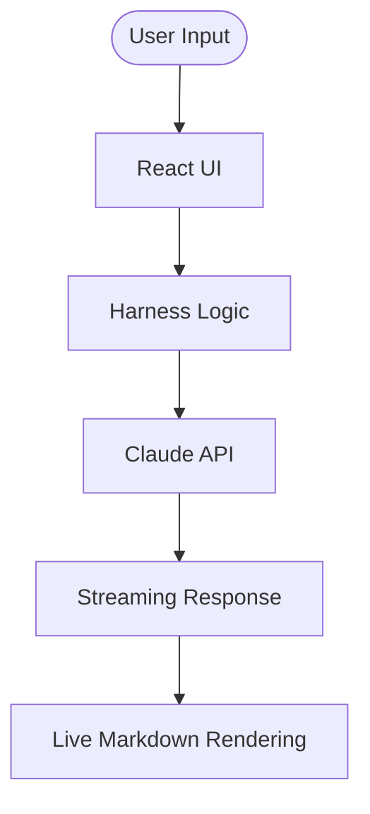

# Technical Architecture: Nava AI Academy

This document outlines the architectural decisions and design patterns used in the
Nava AI Academy platform — an internal AI-literacy training app that teaches the Nava
AI Literacy Skills Matrix (Stages 1–2).

## 1. AI Provider & Data Layer

The platform is backed by **Claude via API** for its interactive AI features, with a
**Supabase data layer** for persistence. It runs locally in development and is deployed
to a Nava subdomain.

## 2. The "Harness" Pattern

The "Harness" is a software layer that surrounds the raw LLM. In this application, we implement the harness through:

### Component Layers:
1. **System Instructions:** Controlled via `AI_PERSONAS` in `constants.ts`. These set the identity and safety boundaries.
2. **Grounding Context:** Dynamically injected into prompts based on the current lesson or policy snippet.
3. **Grounding & Boundaries:** Lesson context and safety boundaries shape each request so responses stay on-task for the curriculum.

## 3. Data Flow

## 4. Frontend Technology Stack

- **Framework:** React 19 + Vite.
- **Styling:** Tailwind CSS 4.0.
- **Animations:** Motion (motion/react).
- **Content:** Markdown-driven curriculum stored in `src/content/`.
- **Icons:** Lucide React.

## 5. Extensibility: Branding & Injectors

To allow the platform to be generic or specific to a company, we use the `injectBranding` utility:

- **Regex Replacement:** Content strings from markdown files are passed through `injectBranding()` in `ModuleRenderer.tsx`.
- **Placeholders:** Developers should use `{{COMPANY}}`, `{{FULL_COMPANY}}`, and `{{TAGLINE}}` in markdown content.

## 6. Deployment Considerations

The app is built as a Single Page Application (SPA). It runs locally in development and is deployed to a Nava subdomain.
