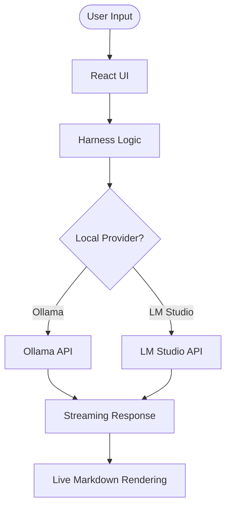

# Technical Architecture: {{COMPANY}} AI Training

This document outlines the architectural decisions and design patterns used in the AI Training platform.

## 1. Local-First AI Strategy

The core architectural requirement is **Zero Data Leakage**. Traditional AI platforms rely on Cloud APIs (OpenAI, Anthropic, Google). This platform defaults to Local Model providers.

### Provider Integration:
- **Ollama:** Primary provider, accessed via `localhost:11434`.
- **LM Studio:** Secondary provider, accessed via `localhost:12345` (OpenAI-compatible endpoint).
- **Service Layer:** `src/services/localProviderService.ts` handles discovery of local endpoints and fetching model lists.

## 2. The "Harness" Pattern

The "Harness" is a software layer that surrounds the raw LLM. In this application, we implement the harness through:

### Component Layers:
1. **System Instructions:** Controlled via `AI_PERSONAS` in `constants.ts`. These set the identity and safety boundaries.
2. **Grounding Context:** Dynamically injected into prompts based on the current lesson or policy snippet.
3. **Model Selection:** Users are encouraged to switch between models (e.g., Llama 3 vs. Phi-3) to understand performance/privacy trade-offs.

## 3. Data Flow

## 4. Frontend Technology Stack

- **Framework:** React 19 + Vite.
- **Styling:** Tailwind CSS 4.0.
- **Animations:** Motion (motion/react).
- **Content:** Markdown-driven curriculum stored in `src/content/`.
- **Icons:** Lucide React.

## 5. Extensibility: Branding & Injectors

To allow the platform to be generic or specific to a company, we use the `injectBranding` utility:

- **Regex Replacement:** Content strings from markdown files are passed through `injectBranding()` in `ModuleRenderer.tsx`.
- **Placeholders:** Developers should use `{{COMPANY}}`, `{{FULL_COMPANY}}`, and `{{TAGLINE}}` in markdown content.

## 6. Deployment Considerations

The app is built as a Static Single Page Application (SPA). It can be served from any static host. However, the **Local AI connectivity** requires the user to be running a provider on their local loopback interface (`127.0.0.1`).
