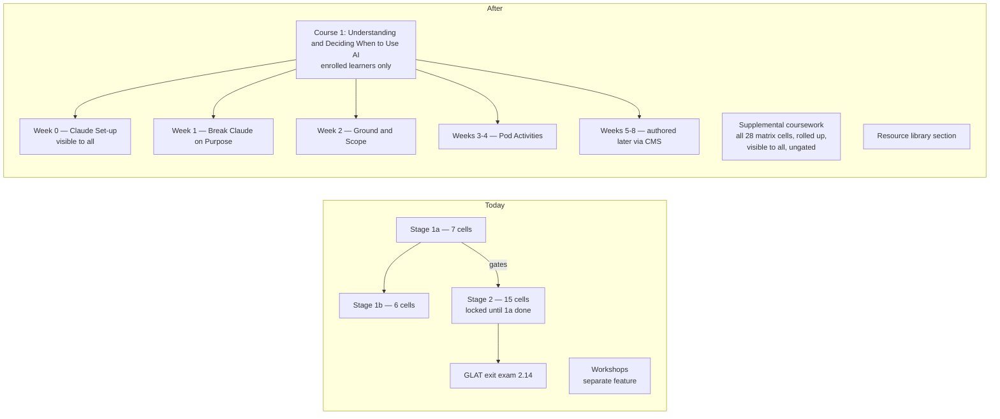

# Cohort Program Restructure — Course 1 + Enrollment Visibility + Cleanup

**Source:** the "AI Academy Outline" tab of the AI Champion-led Cohort Program Google Doc
(Sarah's suggestions, decisions recorded in its TODOs tab), reviewed 2026-07-15.

## Problem Frame

The Academy was built as a self-paced skills-matrix app: 28 cells across Stage 1a/1b/2,
stage gating, quiz-as-completion-gate, and a GLAT exit exam. The program it now serves is
the **AI Champion-led Cohort Program**: 8-week cohorts with live sessions and pod weeks,
where the Academy is the hub for interactive practice. The program's design decisions
(documented in the outline) invalidate several load-bearing structures: curricula must be
**fully unlocked**, organized as **Courses → Weeks** (4 courses coming; Course 1 first),
program-essential content must be **visible only to enrolled learners**, and assessment
shifts from scoring to **participation** (pre/post tests are cut; the doc's drafted
assessment is explicitly deprecated). Without a deliberate restructure + cleanup, the
codebase carries two contradictory models.

### Structure before → after

## Requirements

**Course/Week curriculum structure**

- R1. The curriculum is organized as **Courses → Weeks → modules**, fully unlocked —
  learners can open any item in any order. Course 1 ("Understanding & Deciding When to
  Use AI") ships with Week 0, Week 1, Week 2, and Weeks 3–4 groups populated; Weeks 5,
  6–7, and 8 exist as empty groups authored later. **Week structure, ordering, and module
  assignment require no code change**; later weeks reusing existing exercise kinds are
  CMS-only, while any genuinely new interaction kind remains a code change (Weeks 1–4
  themselves needed three new kinds).
- R2. The 28 existing matrix cells are regrouped into one **"Supplemental coursework"**
  nav section (rolled up/collapsible), visible to all signed-in users, ungated. No lesson,
  quiz, or lab content is deleted. Skills-matrix framing (stage names, cell-id prefixes,
  matrix metadata) disappears from learner-facing UI; activity titles follow the program's
  naming (skills references may appear in body content, never in titles).
- R3. Admins author courses and week groups (create/reorder/assign modules) through the
  CMS, evolving the existing workshop-management authoring pattern. Module editing itself
  is unchanged (existing lesson/quiz/lab editors).
- R4. The primary navigation is a free-jump course tree in the sidebar showing each
  week's items in order (the outline's "sidebar showing the order of items… that is not
  locked"); the guided ordered flow *within* a week evolves from the existing workshop
  stepper and never locks anything. **Workshops as a separate feature are retired** in
  the cleanup phase once courses subsume them; any already-authored workshop rows are
  migrated into course structures (or confirmed absent) before the schema drops.

**Enrollment-based visibility**

- R5. Program-essential content is visible **only to enrolled learners**. Rule: a learner
  with any `enrollments` row has full program access; a learner with none sees only
  Week 0 + supplemental content. Staff (admin/champion) always see everything.
  Course-scoped access is explicitly deferred until Course 2 exists.
- R6. Access lifecycle uses the existing cohort-management UI with zero new admin
  concepts: dropping a learner = unenroll (access removed); finishing a cohort = stay
  enrolled (access retained); test-outs = enrolled into a designated self-study cohort.
  (How a test-out is *determined* is a program decision outside the app — the outline
  lists a pass-out pre-test only as a future goal.) To make this lifecycle survive
  successive cohorts, **enrollment becomes multi-row** (a learner may hold one enrollment
  per cohort, replacing today's one-cohort-per-learner constraint) and **cohort
  archival/deletion is guarded** so it can never cascade-revoke retained access; the
  staff dashboards and aggregation layer that assume single enrollment update in the
  same pass.
- R7. Visibility is enforced at the data layer (row-level), not merely hidden client-side —
  an unenrolled user's browser must not receive program-essential content. (The doc's
  requirement is "not accessible", not "not shown".)
- R8. The Week 0 "Claude Set-up" module is visible to everyone as getting-started content,
  per the doc's stated exception.

**Course 1 content & new exercise types**

- R9. **Week 0 — Claude Set-up**: short module (10–15 min) covering login, desktop app,
  tool areas, recommended starting settings/instructions, and prompting basics; ends by
  pointing to Slack channels/office hours. Skippable by design (intro says so).
- R10. **Week 1 — Break Claude on Purpose**: new *multi-response comparison* exercise —
  the learner enters a prompt (suggested prompts provided, free tweaking allowed) and
  live Claude answers it **3 times side-by-side**; a second experiment is a chat aimed at
  eliciting a confidently wrong answer. Variation/wrongness comes from a **hidden rig in
  the lab config** — per-pane hidden system prompts over real streams. (Anthropic's
  temperature already defaults to its 1.0 maximum, so variance cannot come from "raising"
  it; an optional temperature field is useful only to *lower* a pane's variance and, if
  shipped, is validated and clamped server-side like every other chat input.) Reflection
  questions are displayed as discussion prompts, not captured, without graded feedback
  ("experience" activity).
  Copy uses "Claude", never "LLM" (pre-reveal, per the doc).
- R11. **Week 2 — Ground & Scope for Improvement**: new *dual-chat comparison* exercise —
  two side-by-side chats running the same task ungrounded vs grounded (authored source
  material embedded in the grounded pane), with authored prompt pairs and reflection
  questions (discussion prompts, not captured); no graded feedback.
- R12. **Weeks 3–4 — Pod Activities**: (a) pod intro + delegation brainstorm + scavenger
  hunt as content/capture modules reusing existing kinds; (b) **"Walk the Workflow"** —
  a new *checkpoint decision-scenario* exercise: an authored scenario advances through
  DELEGATE → GROUND → SCOPE → VERIFY checkpoints, each a choice with authored per-option
  feedback shown before the story continues. Per the doc's worked example the v1 flow is
  **linear** — a choice changes the feedback, never the path; divergent branching is a
  later enhancement. v1 checkpoints are multiple-choice (single- and multi-select) with
  pre-planned feedback; free-text-with-AI-feedback is a later enhancement. At least one delivery and one non-delivery scenario (a third,
  eng-specific delivery scenario is desirable); the doc's "Marina" scenario is the first
  delivery script.
- R13. A **resource library** section holds end-of-course/supplemental resources, visible
  to all (the doc's "one space for all additional resources").

**Completion & progress semantics**

- R14. Stage gating is removed everywhere — nothing in course or supplemental content is
  ever locked.
- R15. Completion is **hybrid participation**: any activity submission (lab run recorded,
  quiz attempted, scenario finished) auto-marks the module done, and every module also has
  an explicit "Mark as explored" affordance. Quizzes remain available, scored, and
  retakeable, but never gate completion or navigation. For pod activities (one person
  driving a shared screen), participation credit is individual: activity copy prompts
  each pod member to open the module on their own device and mark it explored — no
  pod-attribution mechanism is built.
- R16. Staff dashboards, learner self-view, and evidence exports continue to work with
  participation semantics (completion = participated/explored; quiz % becomes
  informational).

**Versioning & progress reset**

- R17. Publishing a content update gains a **"reset learner progress for this module"**
  option (default: keep progress) — per the outline's versioning note ("the ability to
  control whether or not past progress/completions are maintained or reset is very
  useful"). A reset must actually stick — it cannot be resurrected by client-side caches
  or the offline completion outbox — and each reset is **audit-logged** (actor, module,
  scope, timestamp), matching the app's existing audit-table pattern for destructive
  admin actions.
- R18. *(Deferred, post-pilot)* Learners can revisit their own prior submissions per
  module. Submissions are already stored append-only, so deferring loses no data.

**Cleanup phase (final, deliberate)**

- R19. Remove deprecated features once the course structure is live, as one coordinated
  phase: stage gating (logic, locked-state UI, gating e2e flow); the quiz-gate machinery
  (quizzes become uniformly ungated); the standalone workshops feature (schema, admin
  function, UI) after courses subsume it; the dead legacy use-case dispatch (debt item
  D-29); learner-facing skills-matrix framing and stage copy. **The GLAT exam experience
  and its dashboard/export surfaces retire only after Cornerstone decision D12 resolves**
  — D12's option B ("participation + GLAT credential") needs GLAT attempts to keep
  accruing, so retiring earlier would decide D12 by elimination; recorded attempt **data
  is retained** either way, and stage metadata stays in the data layer until D12 lands
  (the milestone options key on it). Staff aggregation views are replaced in one
  coordinated migration, and the e2e suite is re-baselined to test the ungated flow.
- R20. Documentation and plan re-baseline ships with the cleanup: PROJECT-PLAN, CLAUDE.md,
  and the content guide reflect the course model; the SME-review backlog (W3-1/P6.5 — 14
  `in_review` matrix cells) is re-scoped to supplemental priority; findings feed the open
  Cornerstone D12 decision — this redesign strengthens the participation-signal options
  and, unless the GLAT keeps accruing attempts, forecloses option B, which is why R19
  sequences GLAT retirement after D12.

## Success Criteria

- An unenrolled @navapbc.com user sees only Week 0 + supplemental coursework + resources;
  after an admin enrolls them via the existing cohort UI they see all Course 1 weeks;
  unenrolling removes access again. Program content rows never reach an unenrolled browser.
- A champion can run the Week 1 breakout live: 3 side-by-side rigged responses stream in
  real time for a room of learners at normal workshop pacing — verified against both the
  app's per-user limiter **and the shared Anthropic account tier's RPM/TPM/concurrency**,
  with a stated mitigation (stagger pane starts, lower max_tokens, tier upgrade) if
  headroom is short.
- Each shipped Week 1 rig config demonstrably produces divergent responses — and, for the
  confidently-wrong experiment, a confidently wrong answer — across repeated trial runs
  including off-script tweaked prompts, checked during authoring before publish.
- Every authored Course 1 activity (Weeks 0–4) is playable end-to-end by an enrolled
  learner; an admin can then author Week 5 as a new week group and assign modules purely
  through the CMS (new interaction kinds, if Week 5's design needs them, remain code
  changes).
- Nothing anywhere is locked; sidebar checkmarks reflect participation; the staff
  dashboard and evidence exports still render correct numbers under the new semantics.
- After cleanup: gating, GLAT, quiz-gate, and workshop code paths are gone; lint, unit,
  and e2e suites are green; no learner-facing screen mentions stages or the matrix.
- A publish with "reset progress" durably clears that module's completions, including for
  a learner with a stale offline cache.
- The pilot cohort reaches the app on the production deployment (not staging), and the
  entire plan — cleanup included — is live before the cohort's Week 1 session.

## Scope Boundaries

- **No Course 2–4 content** — the structure supports them; only Course 1 is populated.
- **No course-scoped access** — the any-enrollment rule is deliberate for the pilot;
  multi-row enrollment ships now (R6), but visibility scoped to a *specific* course waits
  until Course 2 exists.
- **No pre/post test** — cut by the program (doc TODOs: "DECIDED — cutting pre and post
  test"); the drafted assessment is not built.
- **No content-recommendation engine** (doc lists it as a longer-term goal).
- **No learner submission-history view in v1** (R18 deferred).
- **No live facilitated/synchronized mode** — live sessions run in meetings; the Academy
  is the breakout activity surface (X.3 direction B stays deferred).
- **No change to the @navapbc.com-only access model** — "visible to all" means all
  signed-in Nava users, never anonymous access.
- **GLAT data retained** — recorded attempts stay in the database; the exam experience
  retires only after the Cornerstone D12 signal-set decision (see R19), so cleanup never
  forecloses an open decision.

## Key Decisions

- **Matrix content becomes the supplemental library** (rolled up under one nav section):
  nothing valuable is discarded; cleanup targets structure, not content.
- **Deprecate stage gating, GLAT-as-gate, and quiz-as-completion-gate**: the program is
  unlocked and participation-based; these are matrix-era mechanics.
- **Evolve workshops into course curricula** rather than deleting them: the authoring UI
  and stepper are the closest working substrate; the standalone feature retires in cleanup.
- **Any enrollment = full program access**: one rule, zero new admin concepts;
  drop/finish/test-out all map onto existing enrollment operations. The
  one-cohort-per-learner constraint is **relaxed now** to per-cohort enrollment rows
  (with a cohort-deletion guard) — review surfaced that Cohort 2, weeks away, would
  otherwise force alumni to choose between new enrollment and retained access.
- **The full plan, including the cleanup phase, lands before the pilot cohort starts**
  (owner's call over the reviewer suggestion to defer cleanup for pilot evidence): the
  pilot runs on the clean course-model codebase, not a hybrid. The one exception is
  GLAT retirement, which stays gated on Cornerstone D12 regardless of pilot timing.
- **Production deployment is a pilot prerequisite**: prod Supabase provisioning, the
  `release` deploy, the `*.navapbc.com` subdomain (LB-4), and OAuth redirect config are
  named dependencies — the longest-lead, most human-gated items, started now.
- **Live Claude + hidden rig config** for Week 1 (not canned responses, not unrigged):
  learners must be able to tweak their own prompts, and Sarah explicitly asked for
  rigging; devtools-level visibility of the rig is acceptable for an internal tool.
- **Hybrid completion (submit OR mark-done)**: matches "see what you have and have not
  explored" without undercounting real participation.
- **Branching scenario is MC-first**: the doc's worked example is multiple-choice with
  authored feedback; AI-feedback free-text is an enhancement, not v1.

## Dependencies / Assumptions

- The cohort substrate (`cohorts`/`enrollments`/`cohort_champions` + admin management UI),
  the CMS (draft→publish + editors), and versioning snapshots (X.2) already exist and are
  the foundations this builds on — verified against the codebase 2026-07-15.
- The chat proxy already supports per-request system prompts and parallel streams
  (verified). Anthropic's temperature defaults to its maximum, so rig variance rides
  entirely on system prompts; a lower-variance temperature field, if added, is a small
  additive, server-clamped change.
- Live-room capacity is bounded by the shared Anthropic org account tier (RPM/TPM/
  concurrent streams), not just the app's per-user limiter — tier headroom for N learners
  × 3 simultaneous streams must be verified before the Week 1 pedagogy is committed, and
  P6.2 usage alerting assumes single calls (3× sampling shifts its baseline).
- Week 1/2/3–4 activity copy comes from the outline doc (Sarah's drafts, including the
  Marina scenario); wording-level SME review of new course content happens in the
  program's co-design loop, not in this build.
- Weeks 5–8 content genuinely does not exist yet (empty rows in the outline) — the
  structure must not block on it.
- The Playwright e2e suite is serial and assumes the gated flow; a re-baseline is part of
  the work, not incidental breakage.
- **Production deployment is a pilot prerequisite** (only staging exists today): prod
  Supabase project, `release` deploy, the `*.navapbc.com` subdomain (LB-4, via Nava IT),
  and OAuth redirect configuration — people-gated, longest-lead, start immediately.

## Outstanding Questions

### Resolve Before Planning
- (none — product decisions above are settled)

### Deferred to Planning
- [Affects R5/R7][Technical] Exact row-level enforcement design (visibility classes on
  modules vs. course-level flags; interaction with the existing draft-badge posture D10;
  the empty-curriculum error guard must not misfire for legitimately-limited unenrolled
  views; staff dashboards' "total modules" denominators under scoped visibility).
- [Affects R1][Technical] Whether course/week grouping lives as new tables or columns, and
  how existing module ids are preserved so no progress/submission rows orphan.
- [Affects R10][Technical] Rate-limit headroom check for 3× sampling (and whether the
  in-memory limiter needs its durable upgrade first); prompt-caching implications of
  per-pane system prompts.
- [Affects R15][Product+Technical] Which submission events auto-complete (e.g., does any
  quiz attempt count, or only finished activities), and the wording/toggle behavior of
  the "Mark as explored" affordance.
- [Affects R10/R11][Technical] Whether the Week 1 multi-response and Week 2 dual-chat
  exercises share **one parameterized N-pane comparison kind** (per-pane system prompt /
  grounding / pane count) instead of two union members — two reviewers flagged the
  overlap; one kind halves the validator/CMS-editor/test surface.
- [Affects R13][Technical] Whether the resource library reuses/renames the existing
  ungated custom-lessons ("Additional lessons") group rather than adding a fourth nav
  bucket, and how the section is organized.
- [Affects R2][Design] How the 28 supplemental cells are grouped/ordered inside the
  rolled-up section once stage names disappear from learner UI.
- [Affects R1][Design] What an enrolled learner sees for the empty Weeks 5–8 groups
  (hidden until populated vs. "coming soon").
- [Affects R10/R11][Design] Responsive reflow and screen-reader announcement model for
  simultaneous multi-pane streams (a new a11y shape for the app).
- [Affects R16][Technical] Whether completion rows gain a method/era marker (quiz-passed
  vs. participated vs. mark-explored) before semantics flip, so mixed-era evidence
  exports stay interpretable.
- [Affects R17][Design] How a learner is told their progress was reset (banner/notice),
  so a deliberate reset doesn't read as a bug.
- [Affects R17][Technical] Reset mechanics vs. the monotonic client merge + offline
  outbox (version-aware reconcile, cache invalidation), and whether the snapshot write
  must stop being best-effort when it drives resets.
- [Affects R19][Technical] Cleanup ordering (validators/seeds/views have
  delete-order coupling; migrations must apply cleanly on the deployed staging DB).

## Next Steps

→ `/ce-plan` for structured implementation planning (suggested phasing: structure →
visibility → new exercises/content → completion semantics → versioning reset → cleanup).
