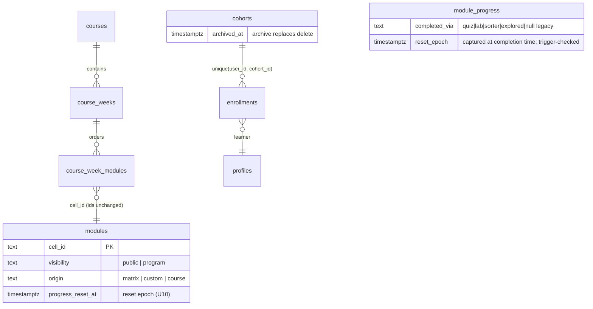
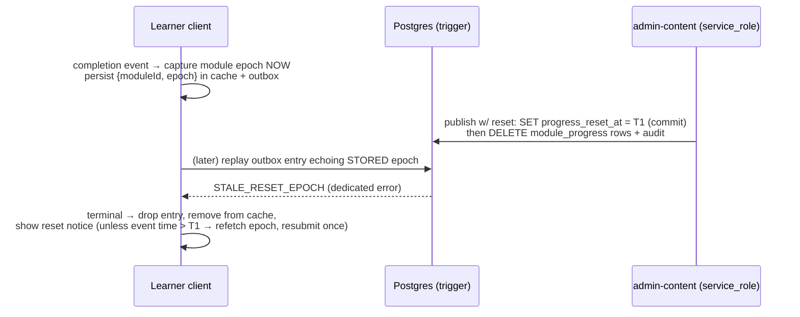

# feat: Cohort Program Restructure

## Overview

Restructure the Academy from a self-paced skills-matrix app into the practice hub for the
AI Champion-led Cohort Program: a **Course → Week** curriculum (Course 1 populated,
fully unlocked), **enrollment-gated visibility** enforced at the RLS layer, **two new
exercise kinds** (N-pane live Claude comparison with a rigged persona; linear checkpoint
decision-scenario), **hybrid participation completion**, **publish-time progress reset**
that survives offline caches, and a **deliberate cleanup phase** removing stage gating,
quiz gates, and the standalone workshops feature. Everything, cleanup included, lands
before the pilot cohort starts; GLAT retirement alone stays gated on Cornerstone D12.

## Problem Frame

The app today encodes a model the program has abandoned: 28 matrix cells across Stage
1a/1b/2, Stage-2 locked behind Stage 1a, quizzes as completion gates, and a GLAT exit
exam. The program (per the AI Academy Outline doc, captured in the origin requirements)
runs 8-week champion-led cohorts where the Academy hosts breakout/pod activities:
unlocked navigation, participation over scoring, program content visible only to
enrolled learners. See origin for the full problem frame, the 20 requirements (R1–R20),
and the recorded product decisions.

## Requirements Trace

| Origin req | Covered by |
|---|---|
| R1 course/week structure, unlocked, CMS-authorable weeks | U1, U2, U3 |
| R2 supplemental coursework section (matrix content kept) | U2 |
| R3 admin course authoring via CMS | U3 |
| R4 free-jump nav + week flow; workshops retired, rows migrated | U2, U12 |
| R5 any-enrollment = program access; staff see all | U4 |
| R6 access lifecycle; multi-row enrollment + deletion guard | U5 |
| R7 row-level (RLS) enforcement | U4 |
| R8 Week 0 visible to all | U1, U4, U8 |
| R9–R13 Course 1 content + new exercise kinds + resources | U6, U7, U8 |
| R14 gating removed everywhere | **U2 (behavior), U11 (deletion)** |
| R15 hybrid participation completion (incl. pod guidance) | U9 |
| R16 dashboards/exports correct under new semantics | U5, U9, U13 |
| R17 progress reset (durable, audited) | U10 |
| R18 submission history | **Deferred** (post-pilot, per origin) |
| R19 cleanup phase (GLAT tranche gated on D12) | U11, U12, U13 |
| R20 docs/plan re-baseline; feed D12 | U13 |

## Scope Boundaries

- No Course 2–4 content; no course-scoped visibility (any-enrollment rule only).
- No learner submission-history view (R18 deferred post-pilot; data is append-only).
- No pre/post test; no content-recommendation engine; no live facilitated mode.
- No change to @navapbc.com-only access; "visible to all" = signed-in Nava users.
- Mark-as-explored is **one-way** in v1 (un-marking needs the same tombstone machinery
  as reset; deliberately not built — see Key Technical Decisions).
- Reset clears `module_progress` only; `quiz_attempts`/`lab_submissions` are append-only
  and survive (invariant: **completion is an event, never derived from submissions**).
- No realtime curriculum invalidation: enrollment changes take effect on reload
  (review trimmed this from U4 — no requirement asks for live flips, and realtime
  DELETE delivery is unreliable for revocation anyway; optional post-pilot polish).
- Rig system prompts are hidden from the **UI**, not the wire: `lab_config_json` reaches
  enrolled browsers and the rig rides the request body. Wire-level visibility is the
  origin's accepted posture for an internal audience — stated here so nobody calls it a
  vulnerability later. Genuinely-hidden rigs (server-side resolution by cell id) are a
  possible follow-up, not v1.

### Deferred to Separate Tasks

- **GLAT retirement tranche** (exam kind, `2.14` seed, `glat_passed`/`glat_pass_rate`
  view columns, GLAT dashboard cards): a pre-scoped follow-up that executes only after
  Cornerstone D12 resolves. U13 documents it; nothing in this plan deletes it.
- **Draft-column closure**: the `modules.draft` jsonb is readable by any authenticated
  user today (client convention hides it). Review showed both quick fixes break the CMS
  read path (`cmsContent.ts` selects `draft` as the same `authenticated` role learners
  use), so this is real scoped work, not a rider on U4: move learner reads to an
  allowlist `modules_learner` view (`security_invoker`, matching the aggregation-layer
  template) **and** move CMS list/detail reads behind the `admin-content` Edge Function
  or an admin-only SECURITY DEFINER view. Pre-existing exposure, internal tool,
  unpublished lesson text — accepted until the follow-up lands.
- **Production deployment** (prod Supabase project, `release` deploy, `*.navapbc.com`
  subdomain LB-4, OAuth redirects): human/IT track, pilot prerequisite — start
  immediately, runs in parallel with this plan (PROJECT-PLAN P7.x).
- **Anthropic org-tier capacity verification** for N learners × 3 streams: check the
  console tier + a synthetic burst test **before U8's rig configs are finalized** —
  mitigation lead times (tier upgrade) must not land inside the pilot window. U6 builds
  the app-side mitigations (stagger, abort, pane-local retry) regardless.
- **Durable rate limiter** (D-21): existing accepted debt; re-evaluate after the burst
  test — not a blocker for this plan.

## Context & Research

### Relevant Code and Patterns

- `src/lib/modules.ts` — `fetchCurriculum` (wholesale fetch, client-side filters),
  `groupIntoPhases`/`STAGE_META` (hardcoded 3-stage grouping to be replaced),
  `assertModuleRow` (enum validation — must evolve in lockstep with schema).
- `src/lib/gating.ts` + `LockedNotice.tsx` + `App.tsx:103–142/171/329–344` +
  `Sidebar.tsx` lock rendering + `useProgress` `isLocked` param — the full gating
  surface. **U2 neutralizes the wiring (behavioral change); U11 deletes the dead files.**
- `src/lib/useProgress.ts` — monotonic union merge + `pendingWrites.ts` outbox
  (bare module-id strings today; replay catches ALL errors and re-parks) +
  `progressCache.ts` (`CACHE_VERSION` bump lever). The reset design (U10) changes the
  outbox/cache **shape** — entries gain a captured epoch.
- `src/components/exercises/*` — `recordLabSubmission` is called inside ~20 individual
  exercise components, **not** in ModuleRenderer; U9's participation hook therefore
  lives in the data layer, not the renderer.
- `supabase/migrations/20260611010000_cohort_substrate.sql` — `enrollments`
  `unique(user_id)` + cascade delete: the two constraints U5 replaces.
- `supabase/migrations/20260612000000` / `20260613000000` — `is_admin()` /
  `is_champion_of()` SECURITY DEFINER helpers and `security_invoker` views: the exact
  template for `is_staff()` / `has_program_access()` (U1). Note `is_champion_of` is
  keyed on the target **user**, not a cohort row — safe today only because of
  unique(user_id); U5 must scope the enrollments policy per-row.
- `supabase/functions/admin-content/` — service_role write path, per-kind
  `LAB_VALIDATORS`, draft→publish, best-effort `content_versions` snapshot,
  `content_changes` audit. U3/U10 extend this function; new-kind validators follow it.
- `supabase/functions/admin-workshops/index.ts` `findUnpublishedSteps` — the
  referential-check precedent U3 mirrors (assignment requires published; archive checks
  membership).
- `src/components/exercises/` — 22 additive `LabConfig` kinds; `PromptEval` (one prompt
  → N streams), `IterationLab` (full chat pane), `PairedCalibration` (two-task config)
  are the assembly parts for `chat-compare`; `ScenarioExercise` / `FailureSpotter` item
  shapes inform `decision-scenario`. `useLabGrading` not needed (both new kinds ungraded).
- `supabase/functions/chat/chat-core.ts` — per-request `system` supported; **no
  temperature param and none needed** (Anthropic default is already the 1.0 max);
  3 parallel streams work today; per-user limit 30/min.
- `.github/workflows/deploy.yml` — **current step order deploys the client (S3 sync +
  CloudFront invalidation) BEFORE `supabase db push`**; U1 reorders it (see decision).
- `src/components/staff/WorkshopManagement.tsx` (434 lines) — the ordered-picker
  authoring UI U3 evolves; `WorkshopRunner` stepper informs the week flow in U2.
- e2e: **19 serial specs** (07 and 08 are each doubled) sharing one demo user;
  `02-stage-gating` unlocks Stage 2 for later specs; chat stubbed at
  `POST **/functions/v1/chat`. New specs take the next free numbers (20-, 21-, …).

### Institutional Learnings

- No `docs/solutions/` directory; the operative learnings live in prior plan docs and
  the audit ledger: additive-only exercise kinds merge cleanly (CLAUDE.md convention);
  seed migrations must be idempotent and guarded (D-25); write-time validation is
  server-authoritative with a client mirror (W2-7/D-16); admin writes always go through
  service_role Edge Functions (W2-2 posture); DATA-02 made the progress merge a
  monotonic union — any un-complete path must be epoch-aware by design.

### Research Provenance

- 7-subsystem parallel codebase scan (this session) — file-level findings cited above.
- 7-persona review of the origin requirements doc (14 auto-fixes + 4 owner decisions).
- Flow analysis (spec-flow-analyzer) — 7 end-to-end flows; its 10 highest-value
  additions are incorporated below.
- 6-persona review of this plan (33 findings) — all P1s resolved in this revision:
  epoch capture-time protocol, deploy.yml ordering, Week 0 unenrolled rendering,
  U2/U11 gating sequencing, U9 call-site architecture, draft-closure de-scope,
  champion cross-cohort scoping, U1 helper sequencing.

## Key Technical Decisions

- **Course/Week is first-class data, membership by join table**: `courses` +
  `course_weeks` + `course_week_modules(week_id, cell_id, sort_order, unique(cell_id))`.
  Module ids never change → zero orphaning of progress/attempts/submissions;
  `CELL_CROSSWALK` and workshop rows stay valid during transition. A module belongs to
  **at most one week** — the unique(cell_id) invariant is exactly why this is a join
  table and not a `step_cell_ids text[]` array (an array can't enforce it): no
  double-counted denominators, no twin checkmarks.
- **One visibility column, referenced everywhere**: `modules.visibility`
  `('public'|'program')`, default `'public'`. Matrix/supplemental/custom/Week 0 =
  public; Course 1 activities = program. **Assigning a module to a week never changes
  its visibility**; a public module assigned to a week renders under that week for
  everyone and leaves the supplemental grouping (supplemental = matrix modules with no
  visible membership) — consistent for all viewers.
- **RLS predicates**: modules policy = `visibility='public' OR has_program_access() OR
  is_staff()`. Structure tables: `course_week_modules` rows are additionally visible
  when they reference a **public** module, and `courses`/`course_weeks` when they
  contain at least one public member — this is what makes Week 0 render inside Course 1
  for an unenrolled user (review caught that a blanket staff-or-enrolled structure
  policy makes Week 0 render nowhere for exactly the population R8 targets). Helpers
  `is_staff()` / `has_program_access()`: SECURITY DEFINER, STABLE, empty search_path,
  postgres-owned — **created in U1, unconditionally** (review killed the "temporary
  authenticated-read policy" caveat: U3 authors real structure in the same phase).
- **New Course-1 modules use `origin='course'`**, stage-less via extending the existing
  `modules_origin_stage_check` (the same constraint that already forces `stage IS NULL`
  for custom). Seeded ids like `c1-w1-break-claude` are migration-minted;
  **CMS-created course lessons get server-generated `course-<slug>` ids** through the
  existing `create-custom` slug machinery (client never mints non-custom ids); week
  assignment happens separately via admin-courses. Unassigned published course-origin
  modules are staff/CMS-visible only, never learner-visible.
- **Deploy ordering fix rides U1**: reorder `.github/workflows/deploy.yml` so
  `supabase db push` + Edge Function deploy run **before** the S3 sync/CloudFront
  invalidation — a failed migration must abort the job before any client publish.
  Every schema+client unit additionally keeps a forward-compatible window for
  already-open tabs: new columns nullable, replacement views created before old
  consumers are removed.
- **One parameterized `chat-compare` kind serves Weeks 1 and 2** (two independent
  review findings): `panes[{label?, systemPromptMd?, sourceMd?}]` (1–4), shared prompt
  input, suggested prompts, reflection prompts. Week 1 Experiment 1 = 3 rigged panes;
  Experiment 2 = 1 adversarial pane (separate module); Week 2 = 2 panes.
- **Rig variance is system-prompt-only** (temperature already at max); prompts include a
  don't-reveal-instructions clause; copy survives non-divergence; wire visibility is the
  accepted posture (see Scope Boundaries).
- **`decision-scenario` is linear**: ordered checkpoints, per-option authored feedback
  before advancing; no branching graph in v1.
- **Completion is an event, never derived state**: auto-complete fires on lab submission
  recorded, quiz **finished** (all questions answered, any score), or sorter submitted —
  never on mere viewing. **The participation hook lives in the data layer**
  (`progress.ts`/`grading` record functions emit a participation event via a small
  subscription seam; `useProgress` subscribes and calls `completeModule(id, via)`) —
  review verified `recordLabSubmission` is called inside ~20 exercise components, so a
  renderer-level hook was infeasible; the data-layer seam is the only option that keeps
  the "no per-component changes" additive-kinds property. Each write stamps
  `completed_via`; the marker column lands **before** the semantics flip.
- **Explored affordance rule** (review P1 — reconciles with `hasCompletionButton`):
  every module renders one footer-level "Mark as explored" button while incomplete,
  replacing the old content-only completion button and its special-casing; it coexists
  with an inline quiz/lab (those auto-complete via participation events). Once
  completed (any path), the footer shows a static "Completed ✓" state; `completed_via`
  is not surfaced to learners in v1.
- **Reset is DB-enforced (epoch), captured at completion time**: see U10 for the full
  protocol. Non-negotiables from review: the epoch is captured **once, when the
  completion happens**, persisted in the outbox entry (`{moduleId, epoch}`) and the
  progress cache — replay/reconcile must never re-derive it from freshly fetched
  curriculum (that resurrects resets); the trigger exposes a **dedicated error contract**
  the client classifies as terminal; the publish action **commits the epoch before the
  delete**; the trigger function is SECURITY DEFINER (empty search_path, postgres-owned)
  so its `modules` read is immune to the caller's RLS visibility; the trigger guards
  only `status='completed'` writes (cursor `in_progress` upserts pass).
- **Cohorts archive, never hard-delete**: `cohorts.archived_at`; hard delete allowed
  only at zero enrollments. **Archiving does NOT unassign or demote champions** (review:
  auto-demotion would strip the ex-champion's program access and their read access to
  the cohort they just ran, while their learners keep both); `cohort_champions` rows
  survive archive, so ex-champions keep read-only dashboard access. Demotion happens
  only on explicit unassign (existing `roleAfterUnassign` rule unchanged).
- **Champion read-scoping under multi-enrollment** (review P1): the champion SELECT
  policy on `enrollments` becomes **cohort-row-scoped** (a champion reads an enrollment
  row only when they champion that row's cohort), replacing reliance on the
  user-keyed `is_champion_of()` for that table — otherwise a champion of cohort A could
  enumerate a dual-enrolled learner's other cohort memberships. The progress/attempts/
  submissions policies keep the existing champion-of-any-shared-cohort posture
  (pre-existing P5.1c behavior; that data isn't cohort-partitioned) — documented as
  accepted.
- **Denominator strategy**: staff views compute `modules_total` via a SECURITY DEFINER
  count over published modules (viewer-independent); learner surfaces compute over the
  learner's visible set and intersect completions with it. U13 asserts no
  learner-facing surface reads the staff views.
- **Curriculum staleness contract**: content is fetched per mount; enrollment changes
  take effect on **reload** (documented; realtime invalidation deliberately cut — see
  Scope Boundaries). Session-duration staleness after unenrollment is accepted; orphan
  progress writes from an unenrolled-mid-session learner are accepted as harmless.
- **Supplemental IA**: one collapsible "Supplemental coursework" section preserving the
  existing sort order (no sub-groups in v1); the custom-lessons group is renamed
  "Resources & additional lessons" and serves R13 (no fourth nav bucket).

## Open Questions

### Resolved During Planning

- All origin deferred-to-planning questions: RLS mechanism, course/week representation,
  kind consolidation, resource-library reuse, supplemental grouping, empty weeks
  (hidden from learners until they contain a published module; staff/CMS always see
  them), auto-complete events (quiz = finished, any score), era marker, reset
  mechanics, draft-badge posture (unchanged), archive/assignment guards, pod
  shared-screen guidance, reset notice.
- Plan-review resolutions (this revision): epoch capture-time protocol; trigger error
  contract; epoch-before-delete ordering; trigger SECURITY DEFINER + completed-only
  scope; stale-session new-work rule (see U10); Week 0 public-membership RLS exemption;
  U2 owns gating neutralization; participation events from the data layer; explored
  button rule; cohort-row-scoped champion enrollment reads; archive keeps champions;
  deploy.yml reorder; realtime refetch cut; draft closure de-scoped; CMS course-id
  generation server-side; workshop rows confirmed-absent-or-logged (prod was never
  deployed; staging-only feature shipped days ago — no automated transform).
- UX decisions (review asked for explicit rules): sidebar defaults — current week
  expanded, other weeks + supplemental + resources collapsed; selecting a module
  expands its container, never collapses others; expansion state is in-memory. Week
  flow = Next/Previous controls in the content pane (no new top-level view; Sidebar
  stays primary). Suggested prompts = clickable chips that fill the input, never
  auto-submit. chat-compare pre-submit = labeled empty pane placeholders; a
  resubmission replaces pane outputs in place (each submission appends its own
  `lab_submissions` row, so history survives server-side). decision-scenario shows
  "Checkpoint X of Y" during play; post-finish revisit = the same stepper locked
  read-only; multi-select checkpoints get a "Check answer" button (single-select
  reveals on selection). Reset notice renders above module content (below the draft
  badge); dismissal is in-memory and it reappears on revisit until the module is
  re-completed — intended v1 behavior, documented.

### Deferred to Implementation

- Exact helper/component names; final trigger SQL; epoch value encoding (timestamptz vs
  bigint) — knowable only against real code.
- N-pane stagger delay tuning (verify against the burst test).
- CMS week-authoring form layout (follow WorkshopManagement's picker).

### Owner / Program (non-blocking for build start)

- **Pilot Week 1 date + slack**: the plan's 13 units serialize heavily through
  U1→U2→U4/U5 and terminate in U13 (a coordination unit), with the e2e suite forcing
  effective serialization for U2/U4/U9/U10/U11/U13. Everything-before-pilot was the
  owner's call; there is currently **no named pilot date and no abort criterion**. If
  the chain slips, the natural cut line is: U10 (reset) and U11–U13 (cleanup) are the
  only units the pilot could technically run without — flag early rather than late.

## High-Level Technical Design

> *This illustrates the intended approach and is directional guidance for review, not
> implementation specification. The implementing agent should treat it as context, not
> code to reproduce.*

Visibility read path: `fetchCurriculum` stays a wholesale select; the **RLS policies**
do the filtering (modules by visibility/enrollment/staff; membership rows exempted for
public modules so Week 0 renders inside Course 1 for everyone). The empty-state guard
keys on **zero rows returned**, never on group shape.

Reset write path (the one flow the current architecture actively fights):

## Implementation Units

### Phase 1 — Course/Week structure (nothing hidden yet)

- [x] **Unit 1: Curriculum structure schema, helpers, Course 1 shell, deploy ordering** ✓ committed 0848d79 (805/805 incl. live-DB gated suite; migration double-applied)

**Goal:** Courses/weeks/membership exist as data with their **final** RLS policies;
`is_staff()`/`has_program_access()` exist; modules gain `visibility` + `course` origin;
the era-marker column lands; deploy.yml stops shipping clients before migrations.

**Requirements:** R1, R8 (marker groundwork for R15/R16)

**Dependencies:** None

**Files:**
- Create: `supabase/migrations/<ts>_course_structure.sql`
- Modify: `.github/workflows/deploy.yml` (db push + functions deploy before S3 sync),
  `supabase/functions/admin-content/admin-content-core.ts` (origin enum),
  `src/types.ts` (Module.origin/visibility)
- Test: `supabase/functions/admin-content/admin-content-core.test.ts`,
  `src/lib/rls.integration.test.ts` (gated)

**Approach:**
- Tables per the ERD. `modules.visibility` default `'public'`;
  `modules_origin_stage_check` extended so `origin IN ('custom','course') → stage IS
  NULL`; `module_progress.completed_via text null`.
- Helpers `is_staff()` / `has_program_access()` created **here** (SECURITY DEFINER,
  STABLE, empty search_path, postgres-owned — is_champion_of template), and the final
  structure-table policies with them: membership rows visible when staff OR enrolled OR
  the referenced module is public; courses/weeks visible when staff OR enrolled OR
  containing ≥1 public member. No temporary blanket policy at any point (U3 authors
  real structure before U4).
- Seed Course 1 + Weeks 0–8 rows (empty membership). Idempotent, re-runnable (D-25).

**Test scenarios:**
- Happy path: migration applies cleanly twice; Course 1 + 9 week rows exist;
  deploy.yml job order verified by inspection/CI dry run.
- Edge case: second membership row for the same cell_id fails (unique).
- Error path: origin='course' with stage non-null violates the extended CHECK.
- Integration (gated): unenrolled authenticated user reads courses/weeks/membership
  only where a public module makes them visible; enrolled user and staff read all;
  anon reads nothing.

**Verification:** `supabase db reset` clean; existing suites green; no learner-visible
behavior change yet.

- [x] **Unit 2: Client curriculum read path, navigation, gating neutralized** ✓ committed 1ef124b (825/825 live-DB; e2e 21/21 on fresh reset)

**Goal:** Learner UI renders Course → Week groups + supplemental + resources, **fully
unlocked in behavior** (gating wiring neutralized here; dead files deleted in U11).
Empty weeks hidden from learners.

**Requirements:** R1, R2, R4, R13, R14 (behavioral half)

**Dependencies:** Unit 1

**Files:**
- Modify: `src/types.ts` (grouping types), `src/lib/modules.ts` (structure fetch + new
  grouping replacing `groupIntoPhases`/`STAGE_META`; zero-rows empty-state
  discriminator; `assertModuleRow` lockstep), `src/lib/useCurriculum.ts`,
  `src/App.tsx` (Academy wiring; **stop passing `isLocked` to useProgress; remove the
  lock guard/LockedNotice branch usage; denominators = completed ∩ visible over
  visible**), `src/components/layout/Sidebar.tsx` (course tree, collapse defaults per
  Key Decisions, no lock rendering), content-pane Next/Previous week-flow controls
  (in `App.tsx`/`ModuleRenderer` footer — no new top-level view)
- Delete: `e2e/02-stage-gating.spec.ts` (behavior it tests ends here; file deletion of
  gating.ts et al. stays in U11), with the serial-suite unlock assumption absorbed into
  `e2e/helpers.ts`
- Test: `src/lib/modules.test.ts`, sidebar/component tests, e2e nav assertions updated

**Approach:**
- Grouping: weeks (with ≥1 published member visible to the viewer) → supplemental
  (matrix modules with no visible membership) → resources (custom). Public modules
  assigned to weeks appear under the week for everyone (Key Decisions).
- Gating is *behaviorally* off from this unit: `resolveNextModuleId` already treats
  `isLocked === undefined` as unlocked; Sidebar lock props/banner go unused (deleted
  in U11). This keeps the suite green through the transition instead of nine units of
  "unlocked goal, locked app" limbo (review P1).

**Test scenarios:**
- Happy path: Course 1 weeks in order; matrix cells once each under supplemental;
  draft-only week hidden from learners; formerly-locked Stage-2 module opens directly.
- Edge case: completions for now-invisible ids → ≤100% progress; zero rows → error
  state; only-public rows → normal render (no FE-02 misfire).
- Edge case: Week 0 (public, in a week) renders inside Course 1 **and not** in
  supplemental — for both an enrolled and (post-U4) an unenrolled viewer.
- Error path: malformed structure row contained by SectionBoundary, not a white screen.
- Integration: stale `currentModuleId` ignored gracefully (existing behavior asserted).

**Verification:** Browser smoke as seeded learner: free-jump everywhere, no locks
anywhere, denominators sane, week Next/Previous works.

- [x] **Unit 3: Course authoring in the CMS** ✓ committed fe2867d

**Goal:** Admins create/rename/reorder weeks and assign/unassign/reorder published
modules; referential guards both directions; course lessons creatable via CMS.

**Requirements:** R1, R3

**Dependencies:** Units 1–2

**Files:**
- Create: `supabase/functions/admin-courses/index.ts` + `admin-courses-core.ts`
  (+ `.test.ts`), `src/lib/adminCourses.ts`, `src/components/cms/CourseManagement.tsx`
  (+ test)
- Modify: `supabase/functions/admin-content/index.ts` (archive checks week membership →
  400 naming weeks; `create-custom` gains an origin='course' variant minting
  `course-<slug>` server-side), `src/components/StaffArea.tsx` (tile),
  `src/components/cms/` (create-lesson origin choice)
- Test: gated integration for the service_role write path + client-write-blocked proof

**Approach:**
- Mirror the admin-workshops/admin-cohorts service_role pattern (auth, domain, admin
  check, CORS, rate limit, audit). Assignment validates published + non-archived
  (mirror `findUnpublishedSteps`); restore does not auto-rejoin.
- UI evolves `WorkshopManagement` (ordered picker, up/down, remove).

**Test scenarios:**
- Happy path: create week → assign published module → learner grouping shows it;
  CMS-created course lesson gets a server-minted `course-<slug>` id.
- Error path: assign draft module → 400 named; archive week member → 400 naming week;
  non-admin 403; anon 401.
- Edge case: reorder round-trips; deleting a week with members requires explicit
  unassign first.
- Integration (gated): service_role path + RLS write-block.

**Verification:** Author Week 5 with an existing kind, publish, and see it as an
**enrolled** learner (visibility enforcement itself arrives in U4 — this verifies
authoring, not hiding).

### Phase 2 — Visibility & enrollment lifecycle

- [x] **Unit 4: Enrollment-based RLS visibility on modules** ✓ committed 8007ba4 (849/849 live-DB; 8-test boundary suite)

**Goal:** Program module rows never reach unenrolled browsers; staff see everything;
Week 0 + supplemental remain open; staff dashboards keep viewer-independent totals.

**Requirements:** R5, R7, R8

**Dependencies:** Unit 1 (helpers + structure policies), Unit 2 (client tolerance)

**Files:**
- Create: `supabase/migrations/<ts>_enrollment_visibility.sql`
- Modify: aggregation-view migration (SECURITY DEFINER published-count helper for
  staff denominators), `e2e/helpers.ts` + seed (demo user enrolled; second
  **unenrolled** seeded user)
- Test: `src/lib/rls.integration.test.ts` additions (gated) using test-inserted
  `visibility='program'` rows (real program content arrives in U8 — the e2e
  visibility spec lands with/after U8; U4's proof is the gated suite)

**Approach:**
- Replace the blanket modules SELECT policy with
  `visibility='public' OR has_program_access() OR is_staff()`.
- D10 unchanged (in_review badge; status filtering stays client-side — only the
  visibility axis moves into RLS). Draft-column closure explicitly **not here**
  (Deferred to Separate Tasks — both quick fixes break the CMS read path).

**Test scenarios:**
- Integration (gated): unenrolled learner receives only public rows (program rows
  absent from the wire); enrolled learner receives all published program rows;
  unenrolled champion and admin receive everything; anon nothing.
- Integration: Week 0 membership/week/course rows visible to the unenrolled learner
  (U1 policies) so Week 0 renders inside Course 1.
- Integration: staff denominators identical for admin and unenrolled champion, and
  unchanged from pre-U4 values.
- Edge case: enrolled learner whose visible course modules are all drafts renders
  normally (no empty-state misfire).

**Verification:** The origin criterion via the gated suite now; the full e2e criterion
(enroll → see; unenroll → reload → don't see) executes once U8 content exists.

- [x] **Unit 5: Multi-row enrollment + cohort lifecycle guard** ✓ committed 9c4ae07 (incl. review-grade dual-enrollment collateral fix + seed/fixture onConflict repairs)

**Goal:** Multiple enrollments per learner; archive replaces delete without touching
champions or enrollments; admin contract updated; staff analytics correct; champion
enrollment reads cohort-row-scoped.

**Requirements:** R6, R16

**Dependencies:** Unit 4

**Files:**
- Create: `supabase/migrations/<ts>_multi_enrollment.sql`
- Modify: `supabase/functions/admin-cohorts/admin-cohorts-core.ts` + `index.ts`
  (`unenroll_learner` gains `cohortId`; `enroll_learner` conflict target
  `(user_id, cohort_id)`; `archive_cohort` action — **does not** unassign champions;
  hard delete only at zero enrollments), `src/lib/adminCohorts.ts`,
  `src/components/staff/CohortManagement.tsx` (per-cohort unenroll, archive + archived
  filter; enroll copy loses "moves the learner"), aggregation-view migration
  (one row per learner×cohort; global rollups dedup), `src/lib/evidenceExport.ts` +
  `csvExport`/`pdfExport` (dedup in all-cohorts mode), `src/lib/dashboard.ts`
- Test: cohort core unit tests, gated integration, export dedup unit tests

**Approach:**
- `unique(user_id)` → `unique(user_id, cohort_id)`; `cohorts.archived_at`.
- **Enrollments SELECT policy becomes cohort-row-scoped for champions** (champion
  reads an enrollment row only when they champion that cohort) — closes the
  dual-enrollment membership-enumeration leak (review P1). Progress/attempts/
  submissions champion policies unchanged (documented accepted posture).
- Archived cohorts: out of enroll pickers; dashboards label read-only; champions of an
  archived cohort keep read access (`cohort_champions` rows survive).

**Test scenarios:**
- Happy path: dual enrollment; access unchanged throughout; archive preserves both.
- Error path: unenroll without `cohortId` → 400; unenroll(A) leaves B; hard delete with
  enrollments → 4xx with count.
- Edge case: archive does not demote its champions; explicit unassign still does.
- Integration (gated): champion-of-A **cannot** read a dual-enrolled learner's cohort-B
  enrollment row (the new row-scoped policy); can still read the learner's progress
  (accepted posture, asserted so the posture is a test, not an accident); dual-enrolled
  learner appears once per cohort in views and once in all-cohorts exports.

**Verification:** Cohort-2 simulation browser-smoked: enroll alumni into cohort 2,
archive cohort 1, access + champion dashboards persist.

### Phase 3 — New exercise kinds

- [x] **Unit 6: `chat-compare` exercise kind (N-pane live comparison)** ✓ committed 85c08c4 (13 component tests; e2e bodies skip-gated until U8)

**Goal:** One parameterized kind powers Week 1 (3-pane rigged; 1-pane
confidently-wrong) and Week 2 (2-pane bare-vs-grounded).

**Requirements:** R10, R11

**Dependencies:** None (additive); content wiring in U8

**Files:**
- Create: `src/components/exercises/ChatCompare.tsx` + `ChatCompare.test.tsx`
- Modify: `src/types.ts`, `src/components/ModuleRenderer.tsx` (dispatch case),
  `admin-content-core.ts` validator + `src/lib/labValidation.ts` mirror
- Test: component tests + `e2e/20-chat-compare.spec.ts` (multi-stream stub — the
  existing single-endpoint stub gains per-call responses)

**Approach:**
- Config per Key Decisions. Pre-submit: labeled empty pane placeholders. Suggested
  prompts: chips that fill the input (never auto-submit). Resubmission replaces pane
  outputs in place; each submission appends its own `lab_submissions` row.
- Failure spec: pane-local error + retry (siblings keep streaming); partial completion
  still records; every pane on an `AbortController` cleaned up on unmount; pane starts
  staggered ~200ms. `PiiNotice` on the input.
- A11y: one polite live region announcing pane lifecycle; single-column reflow below
  desktop.
- Reflection prompts render as discussion copy (not captured), including the authored
  non-divergence fallback framing.

**Test scenarios:**
- Happy path: 3 panes stream concurrently (stubbed), transcript saved; 1- and 2-pane
  configs render from config alone; chip fills input without submitting.
- Error path: pane 2 errors → local retry; submission records pane-2 error state;
  retry replaces only pane 2.
- Edge case: unmount mid-stream aborts all fetches; double-submit guarded; empty prompt
  blocked; resubmission replaces panes and appends a second submission row.
- Edge case: validator rejects 0 and >4 panes (server + mirror agree); seed-guard test
  covers U8 configs.
- Integration: e2e 3-pane run against the per-call stub.

**Verification:** Live local stack: real 3× stream, rigged pane diverges on a suggested
prompt, abort verified in the network panel.

- [x] **Unit 7: `decision-scenario` exercise kind (Walk the Workflow)** ✓ committed e428846 (11 component tests)

**Goal:** Linear checkpoint scenario with per-option authored feedback; choices
recorded.

**Requirements:** R12

**Dependencies:** None (additive)

**Files:**
- Create: `src/components/exercises/DecisionScenario.tsx` + test
- Modify: `src/types.ts`, `src/components/ModuleRenderer.tsx`,
  `admin-content-core.ts` validator + `labValidation.ts` mirror
- Test: component test + e2e coverage inside the Course-1 spec (U13)

**Approach:**
- Config per Key Decisions. "Checkpoint X of Y" indicator during play; single-select
  reveals feedback on selection, multi-select via a "Check answer" button; answers
  immutable once revealed; back-navigation for review; post-finish revisit = the same
  stepper locked read-only. One submission on finish.

**Test scenarios:**
- Happy path: 4-checkpoint walk end-to-end; multi-select checkpoint requires Check
  answer before feedback; progress indicator advances.
- Edge case: post-finish revisit is read-only; refresh mid-scenario restarts (in-memory,
  documented).
- Error path: validator rejects <2 options or empty feedback; submission failure keeps
  choices and offers retry.
- Integration: finish triggers the U9 participation hook (asserted once U9 lands).

**Verification:** The Marina scenario plays end-to-end matching the outline's worked
example.

### Phase 4 — Course 1 content

- [x] **Unit 8: Course 1 seed (Weeks 0–4) + resources** ✓ committed aded56c (rig live-verified vs real Claude; Exp-2 rig iterated after round-1 refusals)

**Goal:** All authored Course 1 activities exist as data and are assigned to weeks;
the enrollment-visibility e2e spec becomes executable.

**Requirements:** R8, R9, R10, R11, R12, R13

**Dependencies:** Units 1, 3 (assignment path), 6, 7

**Files:**
- Create: `supabase/migrations/<ts>_seed_course1_content.sql` (idempotent, guarded),
  `supabase/seed-data/course1-content.json` + generator (separate from the matrix
  pipeline), `e2e/21-enrollment-visibility.spec.ts`
- Test: seed-guard test over all new configs; gated RLS test that the unenrolled seeded
  user reads Week 0 but no program module

**Approach:**
- Modules as listed in Key Decisions (`c1-w0-claude-setup` public; Week 1 two
  chat-compare modules; Week 2 chat-compare; Weeks 3–4 pod modules incl. two
  decision-scenarios — third eng-delivery scenario if copy is ready); resources as
  custom lessons in the renamed group. Copy from the outline doc; "Claude" never "LLM"
  in Week 1; rig prompts with don't-reveal clause + fallback framing.
- Rig verification protocol (origin success criterion): repeated trial runs per rigged
  config including off-script prompts, before seed finalization; outcomes recorded in
  the PR. **Requires the Anthropic burst test done first** (Deferred task — sequencing
  note).

**Test scenarios:**
- Happy path: db reset → all Course 1 modules exist, correctly assigned and
  visibility-classed; seed applies twice.
- Edge case: all configs pass validators (seed-guard); unenrolled user's e2e run sees
  Week 0 inside Course 1 + supplemental + resources and nothing else.
- Test expectation for copy accuracy: none — the program co-design loop owns wording;
  the rig trial-run protocol is the exception and is mandatory.

**Verification:** Enrolled-learner browser walkthrough of Weeks 0–4 end-to-end;
unenrolled walkthrough sees exactly Week 0.

### Phase 5 — Completion semantics & progress reset

- [x] **Unit 9: Hybrid participation completion** ✓ committed f5f55eb (data-layer seam; quiz gates removed entirely)

**Goal:** Participation events auto-complete; universal one-way "Mark as explored";
quizzes never gate; `completed_via` stamped.

**Requirements:** R15, R16

**Dependencies:** Unit 1 (column), Unit 2 (renderer topology)

**Files:**
- Modify: `src/lib/progress.ts` (participation-event seam: `recordLabSubmission` /
  `recordQuizAttempt` — and the sorter's record path — emit `{moduleId, via}` on
  success to a subscribed callback), `src/lib/useProgress.ts` (subscribe →
  `completeModule(id, via)`; signature/plumbing for `completed_via`),
  `src/components/ModuleRenderer.tsx` (footer explored button per Key Decisions rule,
  replacing `hasCompletionButton` special-casing; "Completed ✓" state),
  `src/components/Quiz.tsx` (`gates` default false; copy drops "100% to move forward"),
  dashboard copy ("participated")
- Test: progress-seam unit tests, ModuleRenderer tests, `useProgress` tests,
  `e2e/04-quiz-persistence.spec.ts` updated, mark-explored e2e assertions

**Approach:**
- The seam lives in the **data layer** (review P1: `recordLabSubmission` is called in
  ~20 exercise components; a renderer hook can't see those calls; per-component
  threading breaks the additive-kinds merge property). No per-component changes.
- Quiz "finished" = all questions answered (any score). D8's 2.1 special case
  dissolves into the same rule.

**Test scenarios:**
- Happy path: 40% quiz finish completes (`via='quiz'`); lab run completes (`'lab'`);
  explored click completes (`'explored'`); footer shows Completed ✓ after each path.
- Edge case: quiz retake never un-completes; duplicate submissions don't duplicate
  progress rows; two-device union convergence asserted.
- Error path: completion write failure parks in the outbox and replays with
  `completed_via` intact.
- Integration: dashboards count participation completions identically to legacy ones;
  a module with an inline quiz shows the quiz AND the footer explored button while
  incomplete (no duplicate completion affordances beyond that rule).

**Verification:** Browser: complete one module each way; sidebar, "My progress", and
staff drill-down agree.

- [x] **Unit 10: Durable progress reset on publish** ✓ committed b6b2342 (FOR SHARE correction over the plan's FOR KEY SHARE; acceptance test rejects epoch re-derivation)

**Goal:** Publish-with-reset durably clears a module's completions, is audited,
notifies learners, and cannot be resurrected — or wrongly reject genuinely new work.

**Requirements:** R17

**Dependencies:** Unit 9

**Files:**
- Create: `supabase/migrations/<ts>_progress_reset_epoch.sql`
- Modify: `supabase/functions/admin-content/index.ts` + `admin-content-core.ts`
  (publish gains `resetProgress`; **order: commit `progress_reset_at = T1` first, then
  DELETE**, audit row with count in `content_changes`),
  `src/components/cms/LessonEditor.tsx` (reset checkbox + confirm),
  `src/lib/progress.ts` / `useProgress.ts` / `pendingWrites.ts` / `progressCache.ts`
  (protocol below), `src/components/ModuleRenderer.tsx` (reset notice per UX decision)
- Test: gated trigger tests, admin-content unit tests, the offline-outbox integration
  test, a **concurrent-write-during-reset** gated test, realtime bulk-delete sanity

**Approach — the epoch protocol (review-hardened, non-negotiable):**
- **Capture at completion time**: when a completion happens, the client captures the
  module's `progress_reset_at` from the in-memory module object and persists it with
  the completion — outbox entries become `{moduleId, epoch, eventAt}` (shape change
  from today's bare string[]), and the progress cache stores per-completion epochs
  (UserProgress shape change → `CACHE_VERSION` bump). **Replay and reconcile echo the
  stored epoch and never re-derive it from freshly fetched curriculum** — re-derivation
  is precisely the resurrection bug.
- **Trigger**: BEFORE INSERT/UPDATE on module_progress, `status='completed'` writes
  only (cursor `in_progress` passes); SECURITY DEFINER, empty search_path,
  postgres-owned (its modules read must not depend on the caller's RLS visibility —
  e.g. an unenrolled learner replaying against a now-invisible program module must
  still be correctly rejected, fail-closed). Rejects when the supplied epoch is null
  or older than `modules.progress_reset_at`, raising a **dedicated error contract**
  (fixed message prefix / SQLSTATE, e.g. `STALE_RESET_EPOCH`).
- **Client classification**: `completeModule`/replay treat `STALE_RESET_EPOCH` as
  terminal — with one refinement: if the completion's `eventAt` is **after** the
  server's current `progress_reset_at` (genuinely new work done during a stale
  session), refetch the epoch and resubmit once; otherwise drop the entry, purge from
  cache, surface the reset notice. All other errors stay parked (today's transient
  semantics).
- **Ordering**: epoch commit strictly before the DELETE, and the trigger's modules read
  serializes against it (FOR KEY SHARE or equivalent) — closes the racing-write window.
- Reset notice per UX decision (above draft badge, in-memory dismissal, reappears until
  re-completed).

**Test scenarios:**
- Happy path: publish-with-reset → rows deleted, audit row with count, learner
  reconcile shows incomplete + notice; completion with fresh epoch accepted.
- **Error path (acceptance)**: offline device with a pre-reset outbox entry reconnects
  → replay echoes the stored old epoch → `STALE_RESET_EPOCH` → entry dropped, cache
  purged, notice shown, server stays reset. A deliberately-wrong implementation that
  re-derives the epoch at replay time must FAIL this test.
- Edge case: stale-session learner completes *after* T1 with old in-memory epoch →
  one refetch-resubmit → completion sticks (`eventAt > T1`).
- Edge case: concurrent completion racing the reset transaction is either caught by
  the DELETE or rejected by the trigger — no surviving stale row (gated test).
- Edge case: two sequential resets — second epoch wins; reset on never-completed
  module is a no-op; publish without reset touches nothing.
- Edge case: `in_progress` cursor write from a stale session passes the trigger.
- Integration: unenrolled learner's stale replay against a now-invisible program
  module still rejected (definer read); staff realtime dashboard survives the delete
  burst without thrash.

**Verification:** The origin success criterion verbatim, including the stale offline
cache case, against the live local stack.

### Phase 6 — Cleanup & re-baseline (lands before pilot; GLAT excluded)

- [x] **Unit 11: Delete gating machinery** ✓ committed 733caa4 (with U12)

**Goal:** The now-dead gating files and props are removed (behavior already off since
U2).

**Requirements:** R14, R19

**Dependencies:** Unit 2

**Files:**
- Delete: `src/lib/gating.ts`, `src/lib/gating.test.ts`, `src/lib/gating.extra.test.ts`,
  `src/components/LockedNotice.tsx`
- Modify: `src/App.tsx` / `src/components/layout/Sidebar.tsx` /
  `src/lib/useProgress.ts` — remove the dead lock props, imports, and the `isLocked`
  parameter (wiring was neutralized in U2; this is the deletion pass)
- Test: suites re-run

**Test scenarios:**
- Test expectation: none — pure deletion of dead code; compile + suites are the check.
  The zero-rows empty-state guard (U2) is asserted still present.

**Verification:** grep proves no `stage1a|isModuleLocked|LockedNotice` references
remain; lint/unit/e2e green.

- [x] **Unit 12: Retire workshops + dead-code sweep** ✓ committed 733caa4 (with U11; migration tested on empty + populated tables)

**Goal:** Standalone workshops feature removed; rows confirmed-absent or logged.

**Requirements:** R4, R19

**Dependencies:** Units 2–3, 11

**Files:**
- Create: `supabase/migrations/<ts>_retire_workshops.sql`
- Delete: `supabase/functions/admin-workshops/`, `src/lib/{workshops,useWorkshops,adminWorkshops}.ts`,
  `src/components/{WorkshopList,WorkshopRunner}.tsx`,
  `src/components/staff/WorkshopManagement.tsx`, workshop View/nav/tile wiring,
  legacy `UseCaseLib` dead dispatch (D-29), `workshopsRls.integration.test.ts`
- Test: suites

**Approach:**
- Prod was never deployed and the feature is days old: the migration **asserts zero
  rows or logs their contents into the migration output, then drops** — no automated
  transform (any authored staging workshop is recreated manually as a course week).

**Test scenarios:**
- Happy path: migration clean on empty and non-empty tables (logs then drops); applies
  twice.
- Test expectation for deletions: none — compile + suites.

**Verification:** No `workshop` references outside migration history; db reset clean.

- [ ] **Unit 13: Coordinated views migration, e2e re-baseline, docs re-baseline**

**Goal:** Staff views/exports reflect the new world in one migration (GLAT columns
explicitly carried); the e2e suite tests the ungated, visibility-aware app; docs match
reality.

**Requirements:** R16, R19, R20

**Dependencies:** Units 4, 5, 9, 11, 12

**Files:**
- Create: `supabase/migrations/<ts>_views_cohort_model.sql`, reset e2e spec
- Modify: aggregation views (stage grouping out; **`glat_passed`/`glat_pass_rate` and
  the `'2.14'` literal preserved** — they retire only in the D12-gated tranche),
  `src/lib/dashboard.ts`/`learnerDetail.ts`/`learnerSelf.ts` (stage labels →
  week/section labels), `e2e/helpers.ts`, `PROJECT-PLAN.md` (this restructure as a
  phase; W3-1/P6.5 SME backlog re-scoped to supplemental priority; D12 note),
  `CLAUDE.md` (gating paragraph removed; course model + visibility described),
  `docs/content-guide.md` (course authoring workflow)
- Test: full suite + gated suites + serial e2e from a fresh reset with both seeded users

**Approach:**
- One view-replacement migration; the 7–10 client readers update in the same PR.
- Assert **no learner-facing surface reads the staff views** (denominator semantics
  differ by design; `learnerSelf.ts` uses the owner-RLS fetch path — keep it that way).

**Test scenarios:**
- Happy path: mixed-era learner (legacy quiz completion + participation completion +
  explored) renders correctly on the staff dashboard — one assertion per era.
- Edge case: GLAT card still renders pending D12.
- Integration: full serial e2e green from reset.
- Test expectation for docs: none — prose.

**Verification:** No learner-facing screen mentions stages or the matrix; lint/unit/e2e
green; PROJECT-PLAN reflects this plan.

## System-Wide Impact

- **Interaction graph:** the data-layer participation seam (U9) is upstream of
  useProgress → module_progress → realtime publication → staff dashboards → exports →
  (future) Cornerstone feed. `completed_via` keeps that chain interpretable across eras.
- **Error propagation:** pane-local stream errors stay pane-local (U6); the reset
  trigger's dedicated error is the **only** terminal completion-write error — all
  others keep today's park-and-retry semantics.
- **State lifecycle risks:** the monotonic union merge + outbox is preserved for normal
  flow and pierced only by the epoch protocol (U10); `CACHE_VERSION` bumps at the
  restructure deploy (U2) and the outbox/cache shape change (U10).
- **Deploy ordering:** migrations + Edge Functions deploy before the client (U1's
  deploy.yml fix); each schema+client PR keeps a forward-compatible window for open
  tabs (nullable columns; views created before old consumers removed).
- **API surface parity:** new admin writes ride service_role Edge Functions with audit
  tables; where Edge Functions re-implement authz that RLS also enforces, both places
  change together (scan risk 8).
- **Integration coverage:** gated RLS suites are the boundary proof for U1/U4/U5/U10.
- **Unchanged invariants:** module ids never change; submissions/attempts append-only;
  @navapbc.com triple enforcement untouched; chat request schema unchanged (no new
  fields needed); D10 draft badge preserved; GLAT data and surfaces intact pending D12;
  champion read posture on progress tables unchanged (documented).

## Risk Analysis & Mitigation

| Risk | Likelihood | Impact | Mitigation |
|------|-----------|--------|------------|
| Reset resurrected by outbox/cache | High (without protocol) | High | Capture-time epoch + dedicated error contract + the acceptance test that fails re-derivation (U10) |
| New work wrongly dropped during a reset window | Medium | Medium | `eventAt > T1` refetch-resubmit rule (U10) |
| Deploy window: new client vs old schema | High (was certain) | High | deploy.yml reorder in U1 + forward-compat rule per PR |
| Week 0 invisible to unenrolled users | Certain (as first drafted) | High | Public-membership RLS exemption (U1/U4) + explicit dual-viewer test (U2) |
| Champion enumerates dual-enrolled learner's cohorts | Medium | Medium | Cohort-row-scoped enrollments policy (U5) |
| Live Week 1 throttles on the shared Anthropic tier | Medium | High (demo-day) | Burst test sequenced before U8 finalization; U6 stagger/abort/retry; non-divergence copy |
| e2e suite instability mid-transition | High | Medium | U2 owns the 02-spec removal at the moment behavior changes; second seeded user; U13 full re-baseline |
| Seed pipeline clobbers CMS-published Course 1 edits (DATA-04) | Medium | Medium | Separate course seed JSON + generator; idempotent guarded updates |
| GLAT cleanup forecloses D12 | Low (now) | High | GLAT tranche carved out of U13 explicitly |
| 13-unit serial chain vs unset pilot date | Medium | High | Owner question raised (pilot date + cut line: U10–U13 are the only technically droppable units) |

## Documentation / Operational Notes

- PROJECT-PLAN gains this restructure as a phase with these 13 units; W3-1/P6.5 SME
  backlog re-scoped to supplemental priority; D12 section notes this plan's dependency.
- Prod deploy + subdomain (human track) proceeds in parallel — pilot prerequisite.
- Champion preflight: staff see all content — preflight is "run the activity in-app
  before the session"; one line in the champion guide when content ships.
- P6.2 usage alerting: per-call threshold unaffected (one row per stream); total volume
  rises ~3× during Week 1 sessions — note in the admin usage panel docs.

## Sources & References

- **Origin document:** [docs/brainstorms/cohort-program-restructure-requirements.md](../brainstorms/cohort-program-restructure-requirements.md)
- Program source: "AI Academy Outline" tab of the AI Champion-led Cohort Program doc
  (Google Docs, reviewed 2026-07-15)
- Related plans: `docs/plans/2026-07-02-006-feat-workshop-mode-plan.md` (X.3 — evolved
  here), `docs/plans/2026-07-02-005-feat-content-versioning-plan.md` (X.2 — extended by
  U10), `docs/plans/2026-07-01-001-feat-cornerstone-learning-data-feed-plan.md` (D12)
- Related code: `src/lib/modules.ts`, `src/lib/useProgress.ts`,
  `supabase/migrations/20260611010000_cohort_substrate.sql`,
  `supabase/functions/admin-content/`, `src/components/ModuleRenderer.tsx`,
  `.github/workflows/deploy.yml`
