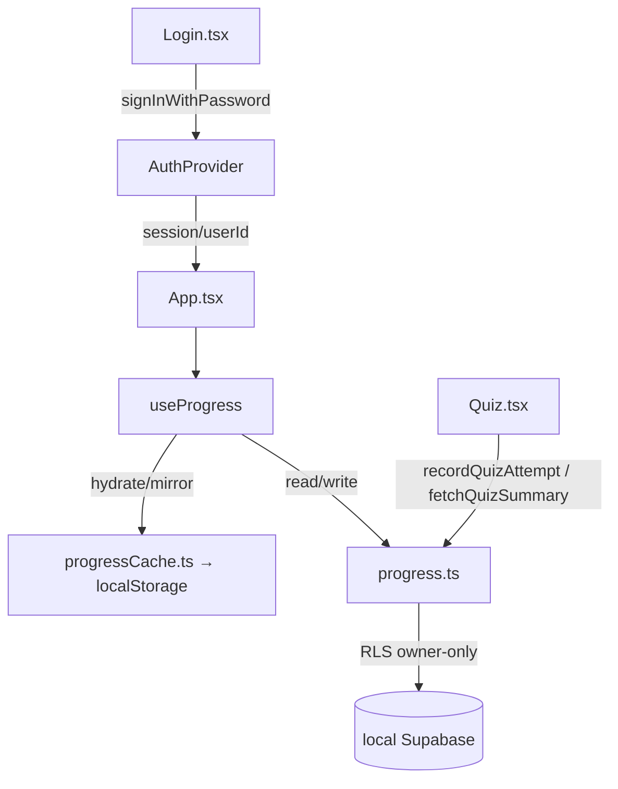

# P1.4 — Data Layer on Supabase

**Phase:** P1.4 — *Progress + quiz scores read/write to local Supabase; localStorage demoted to optional cache.*
**Depends on:** P1.3 (Claude proxy via Edge Function — merged).
**Date:** 2026-05-29
**Branch:** `feat/p1.4-supabase-data-layer`

## 1. Goal

Make local Supabase the source of truth for learner **module progress** and
**quiz scores**. Today all progress lives in `localStorage` (`sprint_progress`)
and quiz scores are never persisted at all. After this phase:

- Module completion and quiz attempts read/write to the local Supabase tables
  (`module_progress`, `quiz_attempts`) that already exist in the schema.
- `localStorage` is demoted to an **optional read-through cache + offline
  fallback** — no longer the source of truth.
- The app obtains a real authenticated session (required by the owner-only RLS
  policies) via a **minimal email/password login screen**.

Out of scope: SSO/OAuth, champion/admin dashboards (P5.1), lab submission
persistence, cloud deployment.

## 2. Context (current state)

- `App.tsx` holds `UserProgress = { completedModuleIds, currentModuleId }` in
  React state, persisted to `localStorage` under `sprint_progress`.
- `Quiz.tsx` tracks score in local component state and only calls `onComplete()`
  on a 100% pass; the score itself is never stored.
- Schema (`supabase/migrations/20260528221204_init_core.sql`) already defines
  `profiles`, `module_progress` (unique on `(user_id, module_id)`),
  `quiz_attempts` (append-only, no unique constraint), and `lab_submissions`,
  all with **owner-only RLS keyed on `auth.uid()`**.
- `src/lib/supabaseClient.ts` exposes `getSupabaseClient()` and
  `isSupabaseConfigured`; currently only `llm.ts` uses it (for the chat proxy),
  and `llm.ts` already prefers the session access token, falling back to the
  anon key.
- A demo user is seeded locally: `demo@nava.dev` / `demo-password`
  (id `00000000-0000-0000-0000-000000000001`) with sample progress + quiz rows.
- There is **no auth UI** in the app yet.

## 3. Decisions

| # | Decision | Choice |
|---|----------|--------|
| D1 | How to get an authenticated session | **Build a minimal email/password login screen** in this PR. SSO lands later. |
| D2 | Role of `localStorage` | **Read-through cache + offline fallback.** Supabase is source of truth; cache enables instant paint and read-only offline use. |
| D3 | Quiz persistence | **Write every completed attempt; read back best/last** to show prior score and pre-mark passed quizzes. |
| D4 | `currentModuleId` (no DB column for it) | **No schema migration.** Derive completion from `completed` rows; write an `in_progress` row when a module opens; resolve "current" as cached cursor → latest `in_progress` row → first incomplete module. |
| D5 | Test runner | **Add Vitest** to the repo as part of this PR. |

## 4. Architecture

Chosen approach: **Auth context provider + dedicated data-access module + thin
state hook** (each unit small, isolated, and independently testable). Rejected:
inlining everything in `App.tsx` (untestable tangle) and a generic
`Repository<T>` abstraction (over-engineered for two entities).

### 4.1 Auth & session

- **`src/lib/auth.tsx`** — `AuthProvider` + `useAuth()` exposing
  `{ session, user, loading, signIn, signOut }`. Wraps
  `supabase.auth.signInWithPassword` / `signOut` and subscribes to
  `onAuthStateChange` so the session stays live across refreshes.
- **`src/components/Login.tsx`** — minimal branded email/password form. Surfaces
  Supabase errors. Shows the local demo creds as a hint **only in dev**
  (`import.meta.env.DEV`).
- **`App.tsx`** — gates on auth: `loading` → spinner; no session → `<Login>`;
  session → existing app. `main.tsx` wraps `<App>` in `<AuthProvider>`.
- **`llm.ts`** — unchanged; it already prefers the session token and now starts
  receiving a real one.

### 4.2 Data-access module — `src/lib/progress.ts`

Pure async functions (no React, no localStorage), so they unit-test against the
local Supabase stack. Each maps DB rows ↔ app types and throws on error.

- `fetchModuleProgress(userId)` → `{ completedModuleIds, inProgressModuleIds, latestInProgressId }`.
- `setModuleStatus(userId, moduleId, status)` → **upsert** on `(user_id, module_id)`;
  sets `completed_at` when `status === 'completed'`, bumps `updated_at`.
- `recordQuizAttempt(userId, { moduleId, score, maxScore, passed, answers })` →
  **insert** one row (append-only history).
- `fetchQuizSummary(userId, moduleId)` → `{ best, latest }` attempt (or `null`).

### 4.3 State, cache & the `currentModuleId` gap — `useProgress(userId)`

Hook owns the lifecycle:

1. **Hydrate** synchronously from `localStorage` (`sprint_progress`) for instant paint.
2. **Reconcile** — fetch from Supabase, replace state, re-write the cache.
3. **Persist** — `completeModule(moduleId)` / `selectModule(moduleId)` write to
   Supabase *and* mirror to the cache. `selectModule` upserts an `in_progress`
   row for not-yet-completed modules; `completeModule` upserts `completed`.

`completedModuleIds` derive from `completed` rows. `currentModuleId` resolves as:
cached cursor → `latestInProgressId` → first incomplete module → first module.
This gives cross-device resume with **no schema change**.

A small **`src/lib/progressCache.ts`** isolates the localStorage read/write of
the cached `UserProgress` shape (single responsibility, swappable, testable).

### 4.4 Quiz integration — `Quiz.tsx`

- Reads `userId` via `useAuth()`.
- On mount: `fetchQuizSummary` → display "Best: N/M — passed" and pre-mark a
  previously-passed quiz.
- On results: `recordQuizAttempt(...)` with `score`, `max_score`, `passed`,
  and `answers` (map of question index → selected option).
- `onComplete()` still drives module unlock — unchanged.

### 4.5 Data flow

## 5. Error handling

Data failures never crash the UI. The hook catches Supabase errors, logs them,
and surfaces a dismissible non-blocking banner; the cache keeps the app usable
read-only. Writes that fail against Supabase still update the cache so the
learner isn't blocked offline; reconciliation happens on next successful fetch.

## 6. Testing

- **Add Vitest** (`vitest`, scripts `test` / `test:run`).
- **Unit tests** for `progress.ts` against the local Supabase stack: sign in as
  the demo user, then write→read→assert for `setModuleStatus` (upsert idempotency),
  `recordQuizAttempt`, `fetchModuleProgress`, and `fetchQuizSummary` (best/latest).
- **Cache test** for `progressCache.ts` (round-trip + corrupt-JSON fallback).
- **Manual**: complete a module + take a quiz → verify rows in Studio
  (`http://127.0.0.1:54323`); reload → state restores from Supabase; stop the
  stack (`npx supabase stop`) → app still paints from cache (offline fallback).

## 7. Files

**New**
- `src/lib/auth.tsx` — auth context + `useAuth`.
- `src/components/Login.tsx` — login form.
- `src/lib/progress.ts` — Supabase data-access functions.
- `src/lib/progressCache.ts` — localStorage cache helpers.
- `src/lib/useProgress.ts` — state/hydrate/reconcile/persist hook.
- `src/lib/progress.test.ts`, `src/lib/progressCache.test.ts` — Vitest tests.

**Changed**
- `src/main.tsx` — wrap in `<AuthProvider>`.
- `src/App.tsx` — auth gate; replace inline localStorage with `useProgress`.
- `src/components/Quiz.tsx` — record attempts, read summary.
- `package.json` — Vitest dep + scripts.

**Unchanged**
- Schema/migrations, `supabaseClient.ts`, `llm.ts`.
